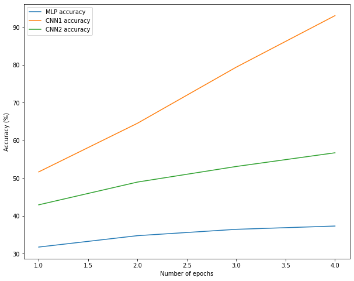

# *Convolutional Neural Network (CNN) for Image Classification*

## Overview

Using Tensorflow, one multilayer perceptron (MLP) and two convolutional network (CNN) were trained to classify images from the CIFAR10 dataset. The dataset was readily divided into training and testing sets using the API for loading the dataset. The new training dataset was created by randomly sampling 20% of the training dataset. The entire test set was used for validation.

### MLP Model
- Fully connected layer with 512 units and a sigmoid activation function
- Fully connected layer with 512 units and a sigmoid activation function
- Output layer with the softmax activation function and 10 neurons

### CNN1 Model: 
- 2D Convolutional layer with 64 filters (size of 3x3) and ReLU activation function
- 2D Convolutional layer with 64 filters (size of 3x3) and ReLU activation function
- Fully connected (Dense) layer with 512 units and a sigmoid activation function
- Fully connected layer with 512 units and a sigmoid activation function
- Output layer with the softmax activation function and 10 neurons

### CNN2 Model:

- 2D Convolutional layer with 64 filters (size of 3x3) and ReLU activation function
- 2x2 Max pooling layer
- 2D Convolutional layer with 64 filters (size of 3x3) and ReLU activation function
- 2x2 Max pooling layer
- Fully connected layer with 512 units and a sigmoid activation function
- Dropout layer with 0.2 dropout rate
- Fully connected layer with 512 units and a sigmoid activation function
- Dropout layer with 0.2 dropout rate
- Output layer with the softmax activation function and 10 neurons

### Arguments
- Batch size = 32
- Adam as the optimizer 
- Sparse categorical crossentropy as loss function
- Each network was trained for 5 epochs.

### Comparison interms of Training Accuracy

